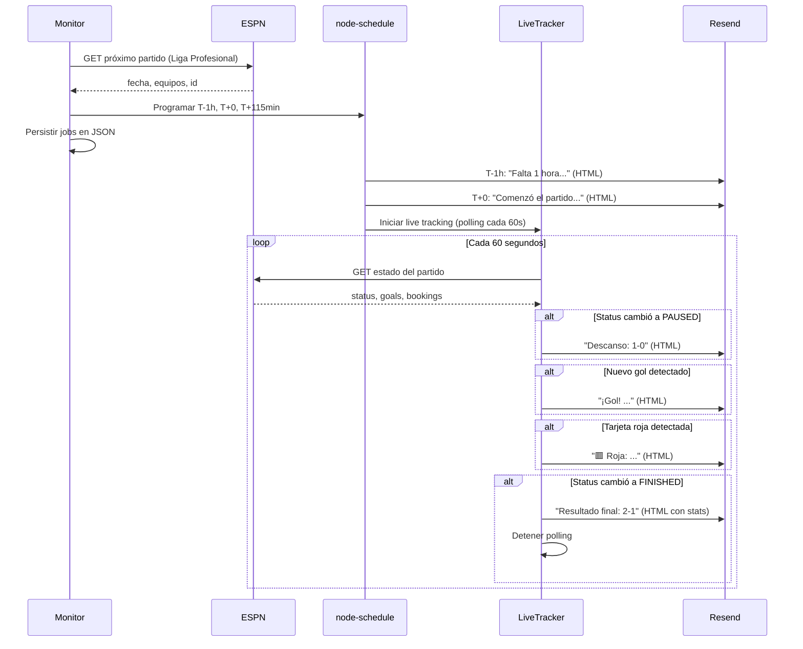

# Monitor - Liga Profesional de Futbol Argentino

Sistema automatizado en Node.js + TypeScript para monitorear los partidos de la Liga Profesional de Futbol Argentino. Consulta la API pública de [ESPN](https://site.api.espn.com/apis/site/v2/sports/soccer/arg.1/scoreboard), programa notificaciones por email con [Resend](https://resend.com/) y expone un comando CLI para consultar cuánto falta para el próximo partido.

## Características

- Consulta los próximos partidos de la Liga Profesional desde ESPN (sin API key).
- Programa notificaciones por email con el SDK oficial de Resend (`resend`):
  1. **1 hora antes** del inicio → asunto dinámico con los equipos
  2. **Al inicio** del partido → asunto dinámico con los equipos
  3. **~115 minutos después** del inicio → verifica si el partido finalizó y envía resultado
- **Live tracking** durante partidos en vivo:
  - Notificación de **descanso** con resultado del primer tiempo
  - Notificaciones de **goles** en tiempo real
  - Notificación de **tarjetas rojas**
  - Email de **resultado final** con goles, tarjetas y sustituciones
- **Resumen matutino** diario (12:00 hs Argentina) con los partidos del día
- **Persistencia de jobs**: las notificaciones sobreviven reinicios del proceso (almacenados en JSON)
- **Caché + Rate Limiter**: reduce llamadas repetidas a la API
- **Retry con backoff exponencial**: recuperación automática de errores de red
- **Emails HTML enriquecidos**: escudos de equipos, colores e información detallada
- CLI con `npm run cuantoFalta` para ver el tiempo restante en consola.
- Diseñado para desplegarse en [Render](https://render.com/) como servicio web de larga duración.

## Estructura del proyecto

```
├── src/
│   ├── index.ts              # Proceso principal (servidor + scheduler)
│   ├── cli.ts                # Comando npm run cuantoFalta
│   ├── config.ts             # Variables de entorno
│   ├── constants/
│   │   └── branding.ts       # Nombre de la liga y del servicio
│   ├── types.ts              # Tipos compartidos
│   ├── apiClient.ts          # Cliente ESPN (con caché + retry)
│   ├── apiCache.ts           # Caché genérico con TTL
│   ├── retry.ts              # Retry con exponential backoff
│   ├── jobStore.ts           # Persistencia de jobs en JSON
│   ├── liveTracker.ts        # Live tracking durante partidos en vivo
│   ├── emailService.ts       # Envío de emails con Resend
│   ├── scheduler.ts          # Lógica de programación de notificaciones
│   ├── schedulerAdapter.ts   # Adaptador node-schedule (testeable)
│   ├── dailyCron.ts          # Resumen matutino diario
│   └── utils/
│       ├── time.ts           # Cálculos y formateo de tiempo
│       ├── timezone.ts       # Manejo de zona horaria Argentina
│       ├── translations.ts   # Traducciones de equipos y etapas
│       └── emailTemplates.ts # Plantillas HTML para emails
├── tests/
├── data/                     # Jobs persistidos (gitignore)
├── .env.example
├── package.json
├── tsconfig.json
└── playwright.config.ts
```

## Requisitos

- Node.js >= 20
- Cuenta en [Resend](https://resend.com/) con dominio verificado para enviar emails

## Variables de entorno

Copiá `.env.example` a `.env` y completá los valores:

| Variable | Requerida | Descripción |
|----------|-----------|-------------|
| `RESEND_API_KEY` | Sí | API Key de Resend |
| `RESEND_FROM_EMAIL` | Sí | Remitente verificado en Resend (ej: `Liga Argentina <notif@tudominio.com>`) |
| `NOTIFICATION_EMAIL` | Sí | Email destino de las notificaciones |
| `PORT` | No | Puerto del health check HTTP (default: `3000`) |
| `LIVE_POLL_INTERVAL_MS` | No | Intervalo de polling para live tracking en ms (default: `60000`) |
| `JOB_STORE_PATH` | No | Ruta del archivo de persistencia de jobs (default: `data/jobs.json`) |

```bash
cp .env.example .env
```

## Instalación

```bash
npm install
```

## Uso

### Servidor principal (monitor + notificaciones)

Desarrollo:

```bash
npm run dev
```

Producción:

```bash
npm run build
npm start
```

El proceso:
1. Levanta un endpoint de health check en `GET /` (útil para Render).
2. Consulta los próximos partidos de la Liga Profesional.
3. Programa las tareas de notificación con `node-schedule`.

### CLI: ¿Cuánto falta?

```bash
npm run cuantoFalta
```

Salida esperada:

```
Faltan 3 horas y 30 minutos para que comience el partido entre Sarmiento (Junín) e Independiente Rivadavia
```

> **Nota TLS (Windows):** Si aparece `UNABLE_TO_VERIFY_LEAF_SIGNATURE`, suele deberse a proxy/antivirus. Workaround temporal: `$env:NODE_TLS_REJECT_UNAUTHORIZED="0"`. Solución segura: `$env:NODE_EXTRA_CA_CERTS="C:\ruta\certificado.pem"`.

## Despliegue en Render

1. Creá un nuevo **Web Service** en Render conectado a este repositorio.
2. Configurá:
   - **Build Command:** `npm install && npm run build`
   - **Start Command:** `npm start`
3. Agregá las variables de entorno en el panel de Render.
4. Render asignará automáticamente la variable `PORT`.

> **Nota:** Este servicio debe permanecer en ejecución continua para que `node-schedule` dispare las notificaciones en el momento exacto.

## Tests

Las pruebas usan [Playwright Test](https://playwright.dev/docs/test-intro) orientado a lógica de API (sin navegador):

```bash
npm test
```

## Flujo de notificaciones



## Licencia

MIT
